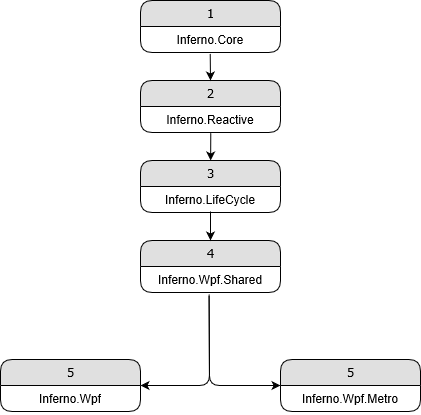

## Bootstrapper

#### Introduction

The bootstrapper houses the app's set up and tear down logic. The set up includes registering the app components. The samples in the repository all use [Simple Injector](https://simpleinjector.org/), but you can use any DI container you see fit. On a related note, Inferno targets Line Of Business applications, in other words, with great flexibility comes required technical debt. It's implicitly assumed that an architect or senior developer will be setting up and fine tuning the components that make up Inferno. This includes swapping out one DI container implementation for another.


#### Implementation

In correspondence with Caliburn-Micro the code `StartupUri="MainWindow.xaml"` is removed from `App.xaml` and instead a bootstrapper is created in `App.xaml.cs`. In the sample below `AppBootstrapper` is our custom (app specific) implementation of `BootstrapperBase`, which will take over the responsibility for showing the main window (or shell view) on start up. As you can see we don't even bother to assign the bootstrapper to a variable. We don't need to because it's not meant to maintain state, it's just an initializer / configurator.

```c#
public partial class App : Application
{
    public App()
    {
        new AppBootstrapper(this);
    }
}
```
The next sample describes its overall flow. In the constructor we tell Inferno to initialize the workflow from the base class. The only reason `Initialize` is exposed, and needs to be explicitly called in the derived class, is to provide an opportunity to intercept the call. In other words, to perform work immediately before or after. Although, in most cases there are better interception points, exposed as virtual methods, that are executed during each stage. 

First and foremost, `Configure` is where you set up your DI container. The returned type is a wrapper that adheres to Inferno's internal contract. If you use a different DI container, you'll need to create a new wrapper specific to your choice. The code for `SimpleInjectorDependencyResolver` is self-explanatory.

```c#
public class AppBootstrapper : BootstrapperBase
{
    public AppBootstrapper(Application application) : base(application)
    {
        Initialize();
    }

    protected override IDependencyResolver Configure()
    {
        // 1. Create a new Simple Injector container
        var container = new Container();

        // 2. A wrapper that adheres to Inferno's internal contract (SimpleInjector adapter).
        // -> There are no direct references to SimpleInjector classes outside of this method.
        var dependencyResolver = new SimpleInjectorDependencyResolver(container);

        // 3. Configure the container
        //    Register app components
        
        // ... 
        // ... Left out for brevity
        // ... 

        return dependencyResolver;
    }

    protected override void OnStartup(object sender, StartupEventArgs e)
    {
        RxApp.Initialize(DependencyResolver, DispatcherScheduler.Current);
        RxLifeCycle.Initialize(DependencyResolver);

        DisplayRootViewFor<ShellViewModel>();
    }

    /// <summary>
    /// Override to tell the framework where to find assemblies to inspect for views.
    /// </summary>
    /// <returns>A list of assemblies to inspect.</returns>
    protected override AssemblySource SelectAssemblies()
    {
        return new AssemblySource(typeof(ShellView).Assembly);
    }
}
```
The topic of view resolution is covered shortly, until then `SelectAssemblies` is where you tell Inferno which assemblies to inspect for views. Inferno then uses Caliburn-Micro's convention based mappings to resolve a view for a given view model.

`OnStartup` is where Inferno's internal plumbing is initialized. To keep things modular, the reactive specific and lifecycle specific code has been divided over two separate assemblies. Each initializer is given the instance of our Inferno specific `DependencyResolver` (which is the one returned by `Configure` and is implemented on the base class).

Make sure you've registered the dependencies of your `ShellViewModel` with the dependency resolver before calling `DisplayRootViewFor<ShellViewModel>();`, which is the code that  takes over the responsibility of `StartupUri="MainWindow.xaml"` . 


#### NuGet Packages

The source code uses [NUKE build](https://nuke.build/) as build automation system. Its build cycle logically mirrors how Inferno's assemblies relate internally. 



If you wish to use the native WPF controls (and theming), or use a third party UI library, you can install the `Inferno.Wpf` NuGet package. The second option, `Inferno.Wpf.Metro` serves as an alternative to  `Inferno.Wpf`. In other words you should choose one, and not install both for the same WPF project. `Inferno.Wpf.Metro` uses [MahApps.Metro](https://mahapps.com/) to override the style of the default controls and gives them a metro-ish look. 

The main purpose of publishing these mutually exclusive packages, next to convenience, is twofold:

1.  They both declare the same `XmlnsDefinition` in their respective `AssemblyInfo.cs`.

```c#
[assembly: XmlnsDefinition("http://inferno.net", "Inferno")]
```

So as long as you use this definition to retrieve the Inferno specific building blocks in XAML, you can swap one NuGet package for another without the burden of having to change all the namespaces in your views.

From an early draft of the `ScoreBoard` sample project:

```xaml
<inferno:RxWindow
    x:Class="ScoreBoard.ShellView"
    x:TypeArguments="local:ShellViewModel" 
    xmlns="http://schemas.microsoft.com/winfx/2006/xaml/presentation"
    xmlns:x="http://schemas.microsoft.com/winfx/2006/xaml"
    xmlns:mc="http://schemas.openxmlformats.org/markup-compatibility/2006"
    xmlns:d="http://schemas.microsoft.com/expression/blend/2008"
    xmlns:inferno="http://inferno.net"
    xmlns:local="clr-namespace:ScoreBoard"
    mc:Ignorable="d" WindowStartupLocation="CenterScreen"
    d:DesignHeight="300" d:DesignWidth="300">
    <inferno:CompositionControl x:Name="Host" />
</inferno:RxWindow>
```

There's no way of telling whether this view uses Mahapps.Metro theming or not, as there are no references to either `Inferno.Wpf` or `Inferno.Wpf.Metro`. Both packages implement their own version of  `RxWindow`, which allows them to be interchangeable. Of course, this only holds as long as you adhere to the API of the lowest hanging fruit. To be sure, once you start referencing custom UI library controls or functionality, you will no longer be able to just swap packages and run the application as-is. 

2. They serve as a log of the minimal changes to go from vanilla WPF to a custom library. When you start out with the Metro style, and want to transition to a third party library because of changing specs, the diff between the  `Inferno.Wpf` and `Inferno.Wpf.Metro` packages should help you well on your way.


#### Visual Studio Project Template

The source code contains a .NET framework project template, with the Mahapps.Metro package and bare bones bootstrapper set up. It's a convenient way to quickly start prototyping some ideas or get up and running during tutorials. 

*Note there's also a getting started [tutorial](https://github.com/ingenerics/Inferno.Tutorials).*

You can find `Inferno App (.NET Framework).zip` in the repo's `template` folder.

To install it you need to [locate your Visual Studio templates folder for User templates](https://docs.microsoft.com/en-us/visualstudio/ide/how-to-locate-and-organize-project-and-item-templates#user-templates).

For example, starting from my *Documents* folder.

```
...\Documents\Visual Studio 2019\Templates\ProjectTemplates\
```

Once you've copied the zip file to the `ProjectTemplates` folder, the template should appear in Visual Studio's *Create a new project* dialog.


#### Visual Studio snippets

The source code also contains several Visual Studio snippets. You can import them in Visual Studio by following [these instructions](https://docs.microsoft.com/en-us/visualstudio/ide/walkthrough-creating-a-code-snippet?view=vs-2019#import-a-code-snippet).


#### Next

[View resolution](../ViewResolution/ViewResolution.md)