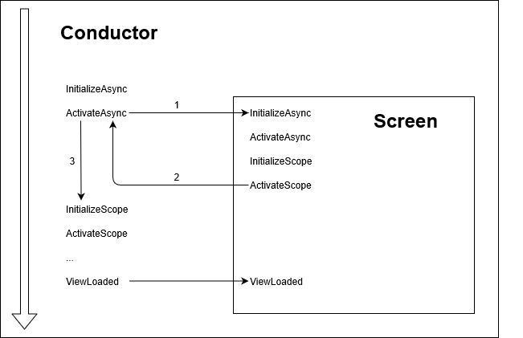

# LifeCycle - Definition

#### Introduction

Before we have a look at how the component lifecycle is implemented in Inferno, it's important to take a step back and clearly define our players. All the more because Caliburn-Micro and ReactiveUI have a different notion of the concept of activation.

#### Comparison

<u>ReactiveUI</u>

A view(model) is activated when a view's `Loaded` event is raised, until either an `Unloaded` event comes along or `IsHitTestVisible` becomes false.

<u>Caliburn-Micro</u>

A component's initialization and (de)activation (or its lifecycle as you will) is managed by its `Conductor`, which is a component residing in the ViewModel layer. It's important to note that the View layer has no involvement in either the initialization or (de)activation of view models.

The `OnViewLoaded` hook on Caliburn's `ViewAware` view models maps to ReactiveUI's `WhenActivated` scope on `IActivatableViewModel`s.

#### Definition

Inferno uses the naming convention used in Caliburn-Micro for its lifecycle concepts. The two main players in Inferno's *reactive* lifecycle are `Activator` and `ViewSink`. These enable the scopes where you can define your reactive pipelines on a viewmodel.

*Activator*

A view model implementing `IActivate` and managed by a `Conductor` is:

- Initialized on first activation.
- Activated/Deactivated as the conductor sees fit. Note there are several implementations for `IConductor`, depending on your requirements, so there's no "one fits all" answer here.

*View Sink*

A view model can be decorated with the `IViewAware` interface, although I previously mentioned:

> This means a viewmodel is completely view agnostic.

So how can a view model be view aware and agnostic at the same time? The key is not allowing the view model to have a direct reference to its view. Instead, the view model stores blocks of code, to be executed when the view is loaded, in a `ViewSink` object. The `View` in `IViewAware` and `ViewSink` is simply for us, to wrap our heads around. But from the view model's point of *view*, it could've been named anything. It's just something where it stores future actions.

A view model implementing `IViewAware` and with a corresponding view that has affinity with an implementation of `ILoadedForViewFetcher` (maps to ReactiveUI's `IActivationForViewFetcher`) has:

- A `WhenLoaded` scope that can be used to set up actions that are executed when the view model has been activated *and* the corresponding view is added the Visual Tree. And to clean up any residue from those actions when the view is removed from the Visual Tree. Note this scope will only be executed if there is also a `WhenLoaded` scope defined in the view (analogous to the workings of ReactiveUI's `WhenActivated` scope on view models).

A view implementing `IViewFor` has:

- Access to a `WhenLoaded` scope that, in accordance to the view models `ViewLoaded` scope, can be used for setting up / tearing down subscriptions when the view is added / removed from the visual tree. As you can imagine, it can be beneficial to use this scope to declare your bindings.

*Screen*

The concepts of Caliburn-Micro's `Screen` and `Conductor` have also been implemented in Inferno. Next to the Caliburn-Micro specific `Task` based activation cycle, `Screen` also serves as a base implementation for the reactive scopes discussed above. `Conductor` derives from `Screen` as well, making these base players fully lifecycle aware.

So what is the resulting flow during activation? 

The drawing below refers to:

-  the `Task` based Caliburn-Micro hooks as `XXXAsync` 
-  the ReactiveUI based scopes as `XXXScope`

*Helicopter view*

The big arrow on the left resembles the timeline. On first activation, any `InitializeXXX` hooks / scopes will be executed, followed by their `ActivateXXX` counterparts. When all activation code is done and the view is loaded, the blocks of the `WhenLoaded` scopes are executed as well. Both `Screen` and `Conductor` reside in the ViewModel layer, while WPF's `Loaded` event always originates on the root View, and is then passed on to its children while traversing the Visual Tree. 

*The idea behind it*

The added benefit compared to ReactiveUI's lifecycle implementation, next to having a variety of scopes to choose from, is that a conductor can force the components it is conducting (read: of which it is made up) to initialize and subsequently activate before the conductor's own scopes are executed. By extending and guiding the lifecycle in this way, creating composite views becomes easier.

You know it goes both ways, any initial `Async` setup required to happen before the child components', can be implemented in the `Conductor`'s `XXXAsync` methods.

*Main gotchas*

- Although the task based  `XXXAsync` hooks are executed sequentially, ensuring a component's `InializeAsync` code is executed before its `ActivateAsync` is first called, the reactive `XXXScope`'s are not blocking. This is inherent to their nature, but can be counterintuitive at first.

  This follows from the pull based nature of the `XXXAsync` hooks, and push based nature of the observable pipelines in the reactive `XXXScope`'s. Long story short, once your reactive pipelines are active, those from `WhenInitialized` scopes may well overlap with ones from `WhenActivated` scopes, so don't let that trip you up.

- In Inferno the concept of activated is overloaded. Take the `Conductor` in the graph above. When we reach step number 3, the conductor will have its `IsActive` property set to true (the property itself is implemented on `Screen`, and abstracted by `IActivate`). This means the scopes (eg `WhenActivated`) are executed when the `Conductor` is already active. Which makes sense, if you think about it. 

  An `Activator` manages the execution and disposal of scopes. Once the `Conductor's` `Activator` executed the `WhenActivated` scope, the `Activator` will have its `HasActivated` property set to true. This is the property the scope based switches (discussed later) use to determine the state they're in.

#### Next

[Scope](2_Scope.md)

