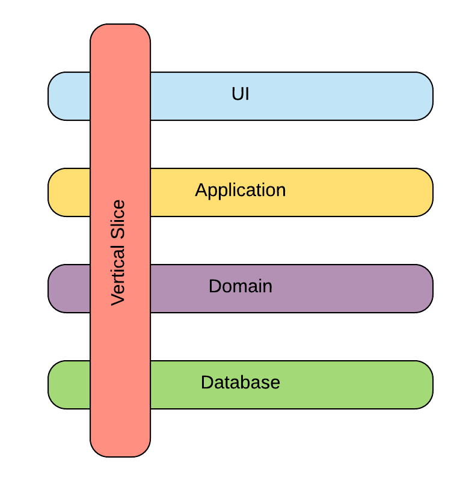

# Main Selling Points

#### Introduction

A topic that's easily the most convoluted of the entire documentation. Nevertheless, here we are.


#### Pit of Success

I'm a firm believer in the Pit of Success. In LOB applications, you don't want to allow room for shortcuts, holes in the design or anything else that will surely bite you later on. 

If a tool shouldn't be used by developers, than don't expose it. 

The best known anti-patterns involve statics or ambient context floating through the application. Waiting to come in handy, and cause headaches down the line.

Other examples relate more to shortcuts being taken. There are many concepts that haven't been implemented in Inferno. In LOB applications you need a sound foundation to build upon, that requires thought and experimentation. As there is no one fits all answer, it is left out of the equation all together.


#### Interception

One design flaw behind ReactiveUI is the use of static constructors to initialize many of the static classes. With no way to intercept these actions, and even worse, no way to tell which order they will be executed in.

Inferno moves the static initialization code to static methods that take all dependencies as method arguments, and not from a static service locator, as there is none in Inferno. This pattern enables interception, a better debugging experience and more control during unit tests. You could, for example, initialize only the components you're interested in. 

Note that in the context of the pit of success, these initialization methods have been made `internal` and should only be called by the `RxApp` and `RxLifeCycle` classes for `Inferno.Reactive` and `Inferno.LifeCycle` respectively. The former exposes these internals for unit testing.

```c#
[assembly: InternalsVisibleTo("Inferno.Reactive.Tests")]
```


#### WPF Rendering

One particular conundrum I've met on the job involves composite UI's and asynchrony:

*If we want our components (eg `Screen`s) to be autonomous, enabling plug and play behavior, when should they make their asynchronous calls?*

One academic answer, of course, would claim that they shouldn't! Let the root view model fetch all data and pass it on to the children. This does imply, however, that the root needs to know about all possible children, and all data they *might* need. We could go down that road and factor in lazy loading and such. Still it is obvious we can no longer consider our components as truly autonomous and interchangeable. As upstream components need intricate knowledge of downstream ones.

Back to our little conundrum, what's the big deal anyways?

Well, say we have a root component composed out of multiple children. If one child is already causing WPF to render some stuff, while other children are still making asynchronous calls in order to update their UI, we can quickly run into the trap of creating synchronization gaps due to context switching. These gaps show up when timeline profiling and can be tricky to explain, to say the least. And even harder to resolve, without coupling the components in an attempt to aggregate these asynchronous calls on the root. 

If you're not convinced the autonomous component approach could actually work, consider Udi Dahan’s (DDD expert) Autonomous Business Components. These components do not only encapsulate the logic of separate contexts in the domain, they extend to the UI layer as well. To be sure, these contexts are given the responsibility for owning specific regions of the user interface. In other words, a user action in such region is handled by one "vertical component" in the application, which has an intricate knowledge of the concerned domain. It's clear that this could involve an asynchronous call, or two, along the way.



The beauty of component lifecycle as it is implemented in Inferno, lies in the fact that the asynchronous methods and the reactive scopes are cleanly separated. Making it possible to execute asynchronous calls when a conductor activates, for both himself and any activating (grand)children, and only when all that is completed, execute its reactive (or binding creating) scopes. Keeping this in mind, like a mental picture of the subsequent stages, it can make building composite apps a whole lot easier.

